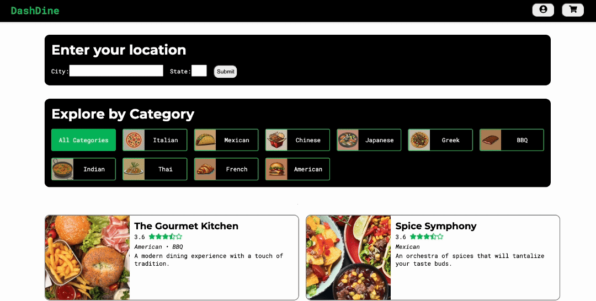
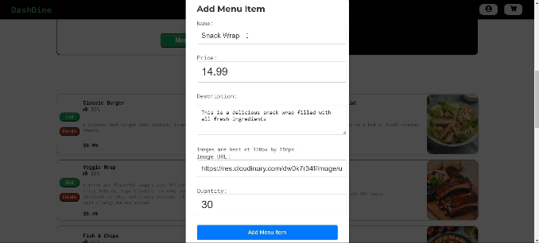
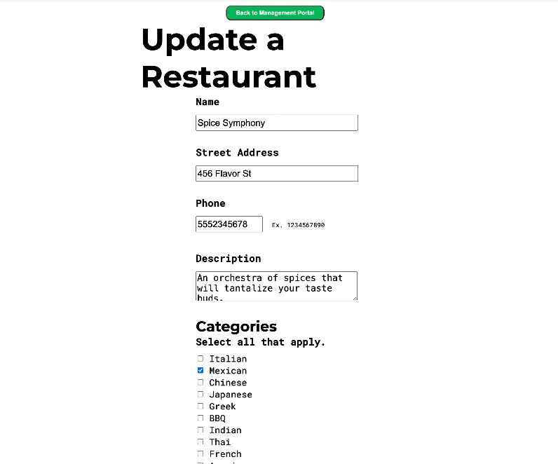
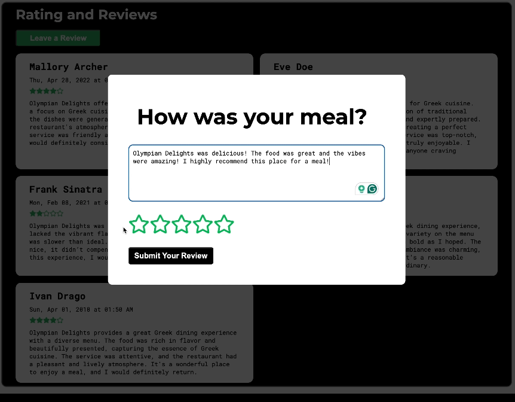
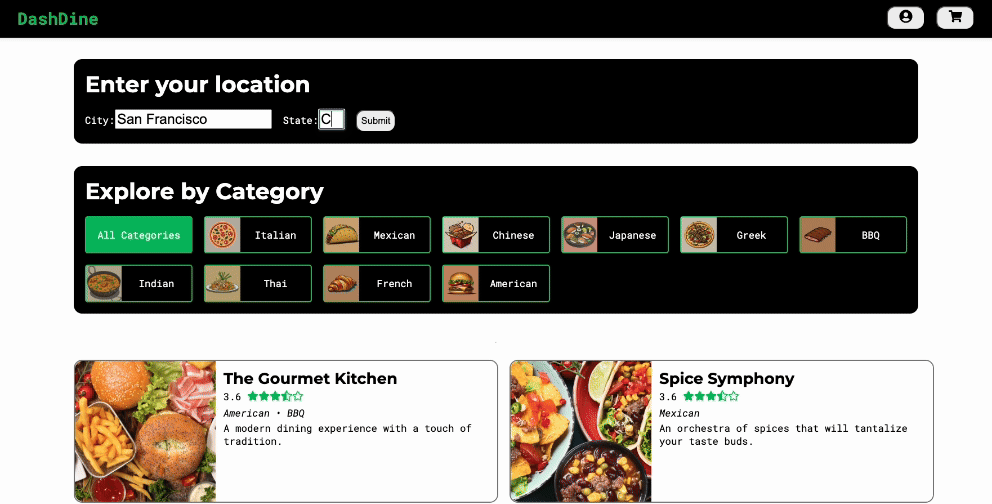

# ==DashDine

DashDine is a website for users to order delivery and rate restaurants and services. It is a full-stack application built using Python in the backend and React in the frontend. It incorporates boostrap CSS for styling, offering a sleek and modern user interface. The platform provides essential functionalities such as signup and login for users to access their accounts, add menu items to their shopping carts, and managing restaurants they own. Furthermore, the shopping cart uses cookies to save the user's shopping cart between visits, ensuring a seamless shopping experience.

## [🌟Live Website🌟](https://dashdine-0s4v.onrender.com)

https://dashdine-0s4v.onrender.com

## Table of Contents

- [Features](#features)
- [Technologies Used](#technologies-used)
- [Set Up ](#set-up)
- [Screenshots](#screenshots)
- [Technical Implementations](#tech-details)
- [Wiki Documentation] (#wiki)
- [Contact](#contact)

## Features

1. Restaurants
2. Menu Items
3. Reviews
4. Shopping Cart

## Future Features

### **1. Search**

- Users should be able to search for restaurants.
- Users should be able to view the results of their search.

### **2. Past Order/Reorder**

- Users should be able to view their past orders.
- Users should be able to reorder any of their past orders.

### **3. Add Menu Item Ratings to Menu Item Components**

- Users should be able to submit reviews for specific menu items they have ordered.
- Restaurant menu items will display accurate ratings based on user reviews.

### **4. Amazon Web Services (AWS) Integration**

- Users should be able to upload their restaurant cover photo.
- Users should be able to upload menu item photos.

## Technologies Used

- **React**: JavaScript library for building user interfaces.
- **Vite**: Fast, modern build tooling for frontend development.
- **Flask**: Python server framework for reliable and versatile API structure
- **WTForms**: Python library for user data backend validations
- **SQLAlchemy**: Python library for SQL Database Management through Object Relational Mapping and translation of Python syntax into raw SQL commands
- **Bcrypt**: Hashing algorithm for creating strong password encryption
- **Git**: For version control and managing distributed developer contributons
<!-- - **Responsive For Mobile** -->

## Set Up

To set up and run the project locally, follow these steps:

1. Clone the repository to your local machine:

   ```bash
   git clone https://github.com/dvidale/python-react-group-proj.git
   ```

2. Navigate to the project directory:

   ```bash
   cd python-react-group-proj
   ```

3. Install the project dependencies:

   In the frontend directory: `python-react-group-proj/react-vite/`

   ```bash
   npm install
   ```

   In the root directory: `python-react-group-proj/`

   ```bash
   pipenv install -r requirements.txt
   ```

4. Create a .env file from the included example file.

5. Start the development servers:

   Backend directory: `python-react-group-proj/`

   ```bash
   pipenv run flask run
   ```

   Frontend directory: `python-react-group-proj/react-vite/`

   ```bash
   npm run dev
   ```

## Screenshots

### DineDash Landing Page
   


### Restaurant Page
   


### Log In
   


### Restaurant Details Page
   


### 5. Add Menu Item
    -->


### Restaurant Update Page
   


### Create A Review
   


### About
   


### Location Based Site Rendering
   


### Cart
   


### CheckOut
   


### Contact
    


### Account
    


## Wiki Documentation

### Find the following additional documentation in our Wiki

- [Database Schema](https://github.com/dvidale/python-react-group-proj/wiki/DashDine-DB-Schema)
- [Features List](https://github.com/dvidale/python-react-group-proj/wiki/DashDine-Features-List)
- [User Stories](https://github.com/dvidale/python-react-group-proj/wiki/DashDine-User-Stories)
- [Redux Store Tree](#redux-store)

## Contact Developers

DeAndré Vidale

- [Github](https://github.com/dvidale)
- [Website](https://deandrevidale.com)
- [Email](mailto:deandre.vidale@gmail.com)
- [LinkedIn](https://www.linkedin.com/in/deandrevidale/)

Hayden Galyean

- [Github](https://github.com/Haydengalyeanbiz)
- [Website](https://haydengalyeanportfolio.onrender.com/)
- [Email](mailto:haydengalyeanbiz@gmail.com)
- [LinkedIn](https://www.linkedin.com/in/hayden-galyean-42a518189/)

Neil Kang

- [Github]()
- [Website]()
- [Email]()
- [LinkedIn]()
