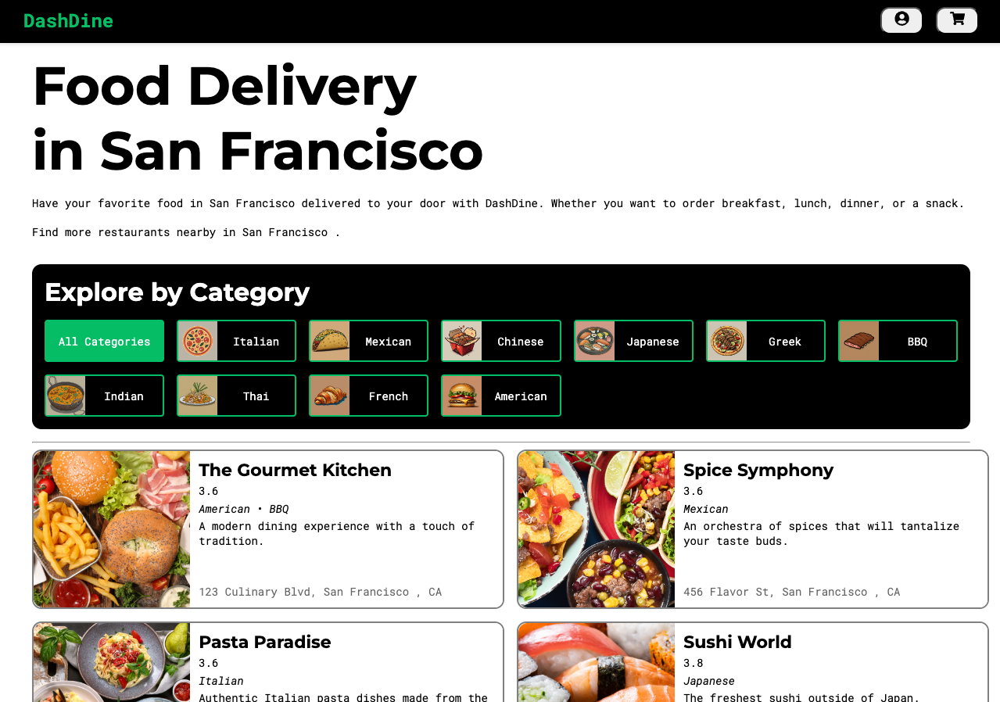

# ==DashDine

DashDine is a website for users to order delivery and rate restaurants and services. It is a full-stack application built using Python in the backend and React in the frontend. It incorporates boostrap CSS for styling, offering a sleek and modern user interface. The platform provides essential functionalities such as signup and login for users to access their accounts, add menu items to their shopping carts, and managing restaurants they own. Furthermore, the shopping cart uses cookies to save the user's shopping cart between visits, ensuring a seamless shopping experience.



## [🌟Live Website🌟](https://dashdine-0s4v.onrender.com)

## Table of Contents

- [Features](#features)
- [Technologies Used](#technologies-used)
- [Set Up ](#set-up)
- [Screenshots](#screenshots)
- [Wiki Documentation] (#wiki)
- [Contact](#contact)

## Features

## **1. Restaurants CRUD**

Without logging in, users can view all restaurants available for delivery via DashDine. A logged in user can also submit a new restaurant to be listed, add and update that restaurant's menu items, and delete any restaurants they have created.

## **2. Reviews**

- Users can view all reviews on a restaurant.
- Users can create a review for a restaurant.
- Users can update their reviews for a restaurant.
- Users can delete their reviews from a restaurant.

## **3. Shopping Cart**

- Users can view all menu items added to their cart.
- Users can add menu items to their shopping cart.
- Users can remove menu items from their shopping cart.
- Users can perform a "transaction" to complete their purchase.

* Users can view all menu items added to their cart.
* Users can add menu items to their shopping cart.
* Users can remove menu items from their shopping cart.
* Users can perform a "transaction" to complete their purchase.

## **4. Menu Items**

- Users can view all menu items for a restaurant.
- Users can add menu items to their restaurants.
- Users can update menu items on their restaurants.
- Users can delete menu items from their restaurants.

## Future Features

## **1. Future Feature: Search**

- Users should be able to search for restaurants.
- Users should be able to view the results of their search.

## **2. Future Feature: Past Order/Reorder**

- Users should be able to view their past orders.
- Users should be able to reorder any of their past orders.

## **3. Future Feature: Add Menu Item Ratings to Menu Item Components**

- Users should be able to submit reviews for specific menu items they have ordered.
- Restaurant menu items will display accurate ratings based on user reviews.

## **4. Future Feature: Amazon Web Services (AWS) Integration**

- Users should be able to upload a photo of their restaurant photo.
- Users should be able to upload a photo of their restaurant cover photo.
- Users should be able to upload a photo of their menu items.

## Technologies Used

- **React**: JavaScript library for building user interfaces.
- **Vite**: Fast, modern build tooling for frontend development.
- **Flask**: Python server framework for reliable and versatile API structure
- **WTForms**: Python library for user data backend validations
- **SQLAlchemy**: Python library for SQL Database Management through Object Relational Mapping and translation of Python syntax into raw SQL commands
- **Bcrypt**: Hashing algorithm for creating strong password encryption
- **Git**: For version control and managing distributed developer contributons
<!-- - **Responsive For Mobile** -->

## Set Up

To set up and run the project locally, follow these steps:

1. Clone the repository to your local machine:

   ```bash
   git clone https://github.com/MMansy19/E-Commerce-Website.git
   ```

2. Navigate to the project directory:

   ```bash
   cd E-Commerce-Website
   ```

3. Install the project dependencies:

   ```bash
   npm install
   ```

4. Install `i18next` for internationalization:

   ```bash
   npm install i18next
   ```

5. Install `react-i18next` for React integration with i18next:

   ```bash
   npm install react-i18next
   ```

6. Install `flowbite-react` for UI components:

   ```bash
   npm install flowbite-react
   ```

7. Start the development server:
   ```bash
   npm run dev
   ```

## Redux Store Tree

| **Slice**        | **Sub-Slice** / **State** Structure                                                                                                                                                            | **Description**                                                   |
| ---------------- | ---------------------------------------------------------------------------------------------------------------------------------------------------------------------------------------------- | ----------------------------------------------------------------- |
| `location`       | { city: STRING, state: STRING }                                                                                                                                                                | Stores the user's selected city and state for filtering listings. |
| `menuItemRating` | { createMenuItemRating: { id: INT, vote: BOOLEAN }, getMenuItemRating: { menu_item_id: INT, percentage: FLOAT } }                                                                              | Manages the creation and retrieval of ratings for menu items.     |
| `menuItems`      | { allArr: [ { id: INT, name: STRING, price: DECIMAL } ], itemArr: [ { id: INT, name: STRING, price: DECIMAL } ] }                                                                              | Contains menu items available in the system and related details.  |
| `restaurants`    | { AllRestaurants: [ { id: INT, name: STRING, city: STRING, state: STRING, avg_rating: FLOAT } ], allCategories: [ { id: INT, name: STRING } ], selectedRestaurant: { id: INT, name: STRING } } | Stores information about restaurants, categories, and selections. |
| `reviewsList`    | { allReviews: [ { id: INT, content: STRING, rating: INT } ], createReview: { content: STRING, rating: INT }, reviewSummary: { id: INT, rating: FLOAT } }                                       | Manages review data including creation and summaries.             |
| `session`        | { user: { id: INT, email: STRING, first_name: STRING, last_name: STRING, username: STRING, city: STRING, state: STRING } }                                                                     | Stores the logged-in user's information.                          |
| `shoppingCart`   | { items: [ { id: INT, name: STRING, price: DECIMAL, quantity: INT } ] }                                                                                                                        | Manages items added to the shopping cart along with quantities.   |

```javascript
  state: {
    location: {
      city: ""
     state: ""
    }
    menuItemRating: {
      createMenuItemRating: {}
      getMenuItemRating: {}
    }
    menuItems: {
      allArr: []
      itemArr: []
    }
    restaurants: {
      AllRestaurants: { ... }
      allCategories: [ ... ]
      selectedCategory: "Default is null, selected is categ_name string"
      selectedRestaurant: {}
    }
    reviewsList: {
      allReviews: []
      createReview: {}
      editReview: {}
      recentReviews: []
      reviewSummary: {}
      reviewListArr: []
      singleReview: {}
      specificReviews: []
    }
    session: {
      user: {
        city: ""
        email: ""
        first_name: ""
        id: 1
        last_name: ""
        state: ""
        username: ""
      }
    }
    shoppingCart: {
      items: [ ... ]
    }
  }

```

## Screenshots

1. E-Commerce HomePage
   
2. Sign Up
   
3. Log In
   
4. Product Details page
   
5. Wishlist
   
6. About
   
7. Cart
   
8. CheckOut
   
9. Contact
   
10. Account
    

## Wiki Documentation

### Find the following additional documentation in our Wiki

- [Database Schema] (#db-schema)
- [React Components] (#react-components)
- [Frontend Routes] (#frontend-routes)
- [Redux store tree document] (#redux-store)
- [API Routes] (#api-routes)
- [Technical Implementations] (#tech-details)

## Contact

- [Author](https://github.com/MMansy19)
- [Website](https://mahmoud-mansy-portfolio.netlify.app/)
- [Email](mailto:mahmoud2abdalfattah@gmail.com)
- [LinkedIn](https://www.linkedin.com/in/mahmoud-mansy-a189a5232)
