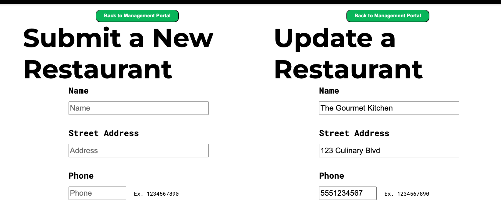
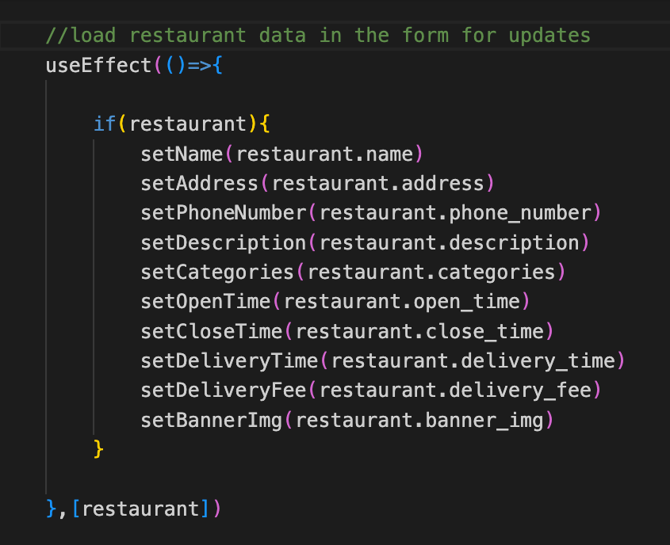
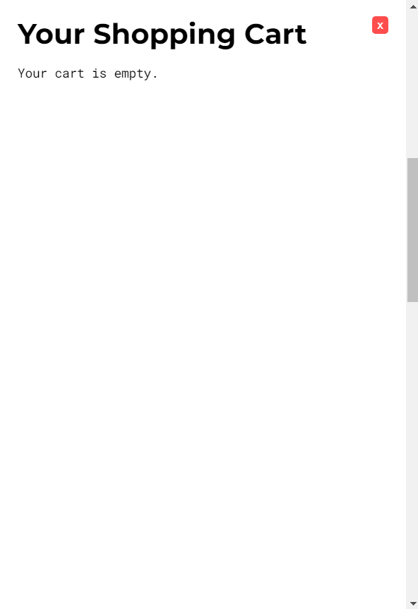
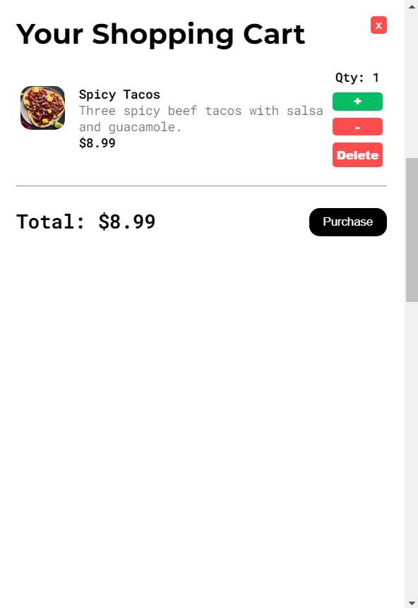
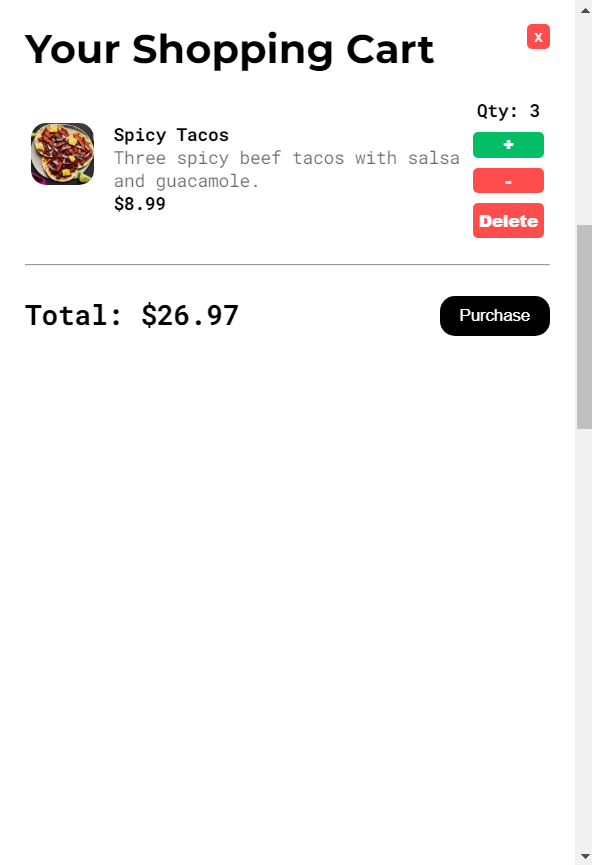

# Technical Implementations

## Restaurant Creation / Update Form UI



The restaurant creation / update form UI leverages React's dynamic data handling to employ one form to handle both user input needs.

The form is structured in a React component that is rendered at both the frontend routes for creating and updating a restaurant.



When a `useParams` hook detects an id is provided, a `useSelector` hook loads the target restaurant from the Redux state with that id. The restaurant data is then detected by a `useEffect` hook that populates the form's controlled inputs with the restaurant's data, now ready for updating. When no id is provided by the route, the form's controlled inputs resort to their default state. The form heading and submit button functionality are also dynamically configured.

Thanks to React's dynamic data handling, the development workload for this UI is cut in half for component creation and CSS styling.

## Shopping Cart UI



The shopping cart in **DashDine** leverages React's dynamic data handling to provide a persistent and interactive shopping experience for users. It allows for both cart creation and modification in a unified interface, seamlessly handling user inputs and cart actions.

The shopping cart is structured as a React component, and it interacts with both the Redux state and cookies to manage cart data across different sessions and page loads.



When the component is mounted, a `useSelector` hook retrieves the current cart data from the Redux state. This data is stored in cookies for persistence. A `useEffect` hook monitors changes to the cart state, ensuring the data is consistently updated in both Redux and cookies. The `useEffect` hook also restores the cart from the cookies if no state exists in Redux, allowing users to resume their shopping session even after refreshing the page or returning later.



The shopping cart dynamically updates based on user actions, such as adding items, modifying quantities, or removing items. These actions dispatch Redux actions to update the cart's state, which triggers a re-render of the UI, providing real-time feedback to the user. The cart’s total price is also recalculated whenever items are added or removed.

The checkout process leverages the stored cart data, where an API call sends the relevant cart details to the backend for secure processing.

By utilizing React's data management capabilities, the shopping cart UI reduces development complexity while ensuring a consistent and reliable shopping experience for users.


## More Reviews Button

the useRef hook is used to create a reference (reviewsSectionRef) that can be attached to the ReviewsList component.

```javascript
const reviewsSectionRef = useRef(null);
```

The primary purpose of useRef here is to allow the component to access and interact with the DOM element that is tied to the ReviewsList component, even though that element is rendered later in the JSX.


The ref={reviewsSectionRef} line attaches the reviewsSectionRef to the ReviewsList component. This means that reviewsSectionRef.current will hold a reference to the DOM element corresponding to ReviewsList once it is rendered.

```javascript
<ReviewsList restaurant={restaurant} ref={reviewsSectionRef}/>
```

forwardRef is being used to allow the parent component to pass a ref to the child component (ReviewsList). This is important because by default, function components cannot receive ref props directly. forwardRef enables this capability.

```javascript
const ReviewsList = forwardRef(({ restaurant }, ref) => { ... });
```

The ref argument passed into ReviewsList represents a reference to a DOM element. In this case, it will be attached to the div with the class review-list-wrapper.
The reference could be used by the parent component to interact with the ReviewsList component's DOM node directly. For instance, the parent could scroll to, focus, or manipulate the ReviewsList’s wrapper div without needing to re-render the component.

```javascript
return (
  <div ref={ref} className='review-list-wrapper'> ... </div>
);
```

In summary, forwardRef is used to allow the ReviewsList component to accept a ref from its parent, enabling the parent to directly interact with the ReviewsList's DOM element. Normally, function components cannot receive ref props, but forwardRef enables this capability. The ref is passed to a div inside ReviewsList, allowing the parent to manipulate that DOM node (e.g., scroll, focus) without re-rendering the component. This pattern is useful for programmatically controlling or interacting with the component's DOM from the parent.
